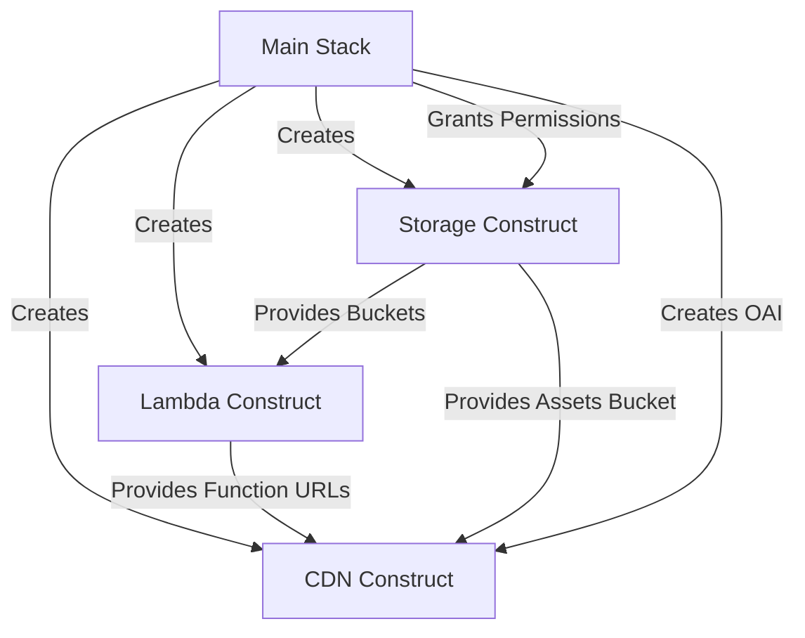

# CDK Constructs Documentation

This project uses modular CDK constructs for better organization, reusability, and maintainability.

## Architecture Overview

The infrastructure is organized into three main constructs:

```
NextjsCdkStack
├── NextjsStorageConstruct    (S3 Buckets)
├── NextjsLambdaConstruct     (Lambda Functions)
└── NextjsCdnConstruct        (CloudFront Distribution)
```

## Directory Structure

```
lib/
├── nextjs-cdk-stack.ts                    # Main stack (orchestrator)
└── constructs/
    ├── nextjs-storage-construct.ts        # S3 buckets & deployments
    ├── nextjs-lambda-construct.ts         # Lambda functions
    └── nextjs-cdn-construct.ts            # CloudFront distribution
```

---

## 1. NextjsStorageConstruct

**Purpose**: Manages all S3 storage resources for Next.js assets and caching.

**Location**: `lib/constructs/nextjs-storage-construct.ts`

### Resources Created:
- **Assets Bucket**: Stores static assets (`_next/static/*`)
- **Image Cache Bucket**: Caches optimized images

### Features:
- ✅ Automatic deployment of OpenNext assets
- ✅ Lifecycle policies for cost optimization
- ✅ Versioning for production environments
- ✅ Encryption at rest
- ✅ CORS configuration
- ✅ Environment-specific retention policies

### Props:
```typescript
interface NextjsStorageConstructProps {
  environment: string;              // dev, staging, prod
  removalPolicy: cdk.RemovalPolicy; // RETAIN or DESTROY
  autoDeleteObjects: boolean;       // Auto-delete on stack deletion
}
```

### Outputs:
- `assetsBucket`: S3 bucket for static assets
- `imageCacheBucket`: S3 bucket for image cache

### Example Usage:
```typescript
const storage = new NextjsStorageConstruct(this, 'Storage', {
  environment: 'prod',
  removalPolicy: cdk.RemovalPolicy.RETAIN,
  autoDeleteObjects: false,
});
```

---

## 2. NextjsLambdaConstruct

**Purpose**: Creates and configures Lambda functions for SSR and image optimization.

**Location**: `lib/constructs/nextjs-lambda-construct.ts`

### Resources Created:
- **SSR Lambda Function**: Handles server-side rendering
- **Image Optimization Lambda**: Processes and optimizes images
- **Function URLs**: Direct invocation endpoints
- **IAM Role**: Lambda execution role with S3 permissions
- **Lambda Alias** (optional): For provisioned concurrency

### Features:
- ✅ ARM64 architecture for better price/performance
- ✅ Automatic S3 permissions
- ✅ Environment-specific configurations
- ✅ Provisioned concurrency for production
- ✅ CORS-enabled function URLs
- ✅ Comprehensive environment variables

### Props:
```typescript
interface NextjsLambdaConstructProps {
  environment: string;
  assetsBucket: s3.IBucket;
  imageCacheBucket: s3.IBucket;
  lambdaMemory: number;
  lambdaTimeout: number;
  enableProvisioning?: boolean;
  provisionedConcurrency?: number;
  environmentVariables?: Record<string, string>;
}
```

### Outputs:
- `ssrFunction`: SSR Lambda function
- `imageOptFunction`: Image optimization Lambda function
- `ssrFunctionUrl`: SSR function URL
- `imageOptFunctionUrl`: Image optimization function URL

### Example Usage:
```typescript
const lambda = new NextjsLambdaConstruct(this, 'Lambda', {
  environment: 'prod',
  assetsBucket: storage.assetsBucket,
  imageCacheBucket: storage.imageCacheBucket,
  lambdaMemory: 2048,
  lambdaTimeout: 30,
  enableProvisioning: true,
  provisionedConcurrency: 5,
  environmentVariables: {
    API_URL: 'https://api.example.com',
  },
});
```

---

## 3. NextjsCdnConstruct

**Purpose**: Manages CloudFront distribution for global content delivery.

**Location**: `lib/constructs/nextjs-cdn-construct.ts`

### Resources Created:
- **CloudFront Distribution**: Global CDN
- **Cache Policies**: Optimized for static and dynamic content
- **Origin Request Policies**: Headers and query string handling
- **SSM Parameters**: Store distribution info for CI/CD

### Features:
- ✅ HTTP/2 and HTTP/3 support
- ✅ Automatic Gzip and Brotli compression
- ✅ Custom domain support
- ✅ Environment-specific cache TTLs
- ✅ Price class optimization
- ✅ Error response handling
- ✅ Multiple origin behaviors

### Origin Behaviors:
1. **Default** → SSR Lambda (dynamic content)
2. **/_next/static/\*** → S3 (static assets)
3. **/_next/image\*** → Image optimization Lambda
4. **/public/\*** → S3 (public assets)

### Props:
```typescript
interface NextjsCdnConstructProps {
  environment: string;
  assetsBucket: s3.IBucket;
  oai: cloudfront.OriginAccessIdentity;
  ssrFunctionUrl: string;
  imageOptFunctionUrl: string;
  cacheTtl: {
    static: number;
    server: number;
  };
  domainName?: string;
  certificateArn?: string;
}
```

### Outputs:
- `distribution`: CloudFront distribution
- SSM Parameters:
  - `/nextjs/{env}/cloudfront-distribution-id`
  - `/nextjs/{env}/cloudfront-domain`

### Example Usage:
```typescript
const cdn = new NextjsCdnConstruct(this, 'CDN', {
  environment: 'prod',
  assetsBucket: storage.assetsBucket,
  oai: originAccessIdentity,
  ssrFunctionUrl: lambda.ssrFunctionUrl.url,
  imageOptFunctionUrl: lambda.imageOptFunctionUrl.url,
  cacheTtl: {
    static: 31536000,  // 1 year
    server: 300,        // 5 minutes
  },
  domainName: 'www.example.com',
  certificateArn: 'arn:aws:acm:...',
});
```

---

## 4. NextjsCdkStack (Main Stack)

**Purpose**: Orchestrates all constructs and manages stack-level configuration.

**Location**: `lib/nextjs-cdk-stack.ts`

### Responsibilities:
- Creates all three constructs
- Manages construct dependencies
- Applies environment-specific configurations
- Handles tagging
- Creates Origin Access Identity
- Provides stack-level outputs

### Props:
```typescript
interface NextjsCdkStackProps extends cdk.StackProps {
  environment: string;
  config: EnvironmentConfig;
}

interface EnvironmentConfig {
  domainName?: string;
  certificateArn?: string;
  lambdaMemory: number;
  lambdaTimeout: number;
  cacheTtl: {
    static: number;
    server: number;
  };
  enableProvisioning?: boolean;
  provisionedConcurrency?: number;
  environmentVariables?: Record<string, string>;
  tags?: Record<string, string>;
}
```

### Example Usage:
```typescript
new NextjsCdkStack(app, 'NextjsStack-prod', {
  environment: 'prod',
  config: {
    lambdaMemory: 2048,
    lambdaTimeout: 30,
    cacheTtl: {
      static: 31536000,
      server: 300,
    },
    enableProvisioning: true,
    provisionedConcurrency: 5,
    domainName: 'www.example.com',
    certificateArn: 'arn:aws:acm:...',
  },
});
```

---

## Benefits of This Architecture

### 1. **Modularity**
Each construct handles a specific concern:
- Storage handles S3
- Lambda handles compute
- CDN handles distribution

### 2. **Reusability**
Constructs can be used in other stacks or projects:
```typescript
// Use in another stack
const storage = new NextjsStorageConstruct(anotherStack, 'Storage', {...});
```

### 3. **Testability**
Each construct can be unit tested independently:
```typescript
test('Storage construct creates two buckets', () => {
  const stack = new cdk.Stack();
  const storage = new NextjsStorageConstruct(stack, 'Storage', {...});
  // Assert bucket creation
});
```

### 4. **Maintainability**
- Easier to understand (single responsibility)
- Easier to modify (isolated changes)
- Easier to debug (clear boundaries)

### 5. **Type Safety**
Strong TypeScript interfaces for props:
```typescript
// Compile-time error if props are wrong
const lambda = new NextjsLambdaConstruct(this, 'Lambda', {
  environment: 'prod',
  // Missing required props will cause TypeScript error
});
```

### 6. **Composability**
Can easily swap or extend constructs:
```typescript
// Extend storage with custom behavior
class CustomStorageConstruct extends NextjsStorageConstruct {
  constructor(scope: Construct, id: string, props: Props) {
    super(scope, id, props);
    // Add custom resources
  }
}
```

---

## Construct Communication



The main stack orchestrates construct creation and dependency injection:

1. **Storage created first** (no dependencies)
2. **Lambda created second** (depends on Storage buckets)
3. **CDN created last** (depends on Storage and Lambda)

---

## Adding New Constructs

To add a new construct (e.g., monitoring):

1. **Create the construct file**:
```typescript
// lib/constructs/nextjs-monitoring-construct.ts
export class NextjsMonitoringConstruct extends Construct {
  constructor(scope: Construct, id: string, props: Props) {
    super(scope, id);
    // Create CloudWatch dashboards, alarms, etc.
  }
}
```

2. **Add to main stack**:
```typescript
// lib/nextjs-cdk-stack.ts
this.monitoring = new NextjsMonitoringConstruct(this, 'Monitoring', {
  environment,
  lambdaFunction: this.lambda.ssrFunction,
  distribution: this.cdn.distribution,
});
```

---

## Best Practices

### 1. **Keep Constructs Focused**
Each construct should have a single responsibility.

### 2. **Use Interfaces for Props**
Always define TypeScript interfaces for construct props.

### 3. **Expose Necessary Resources**
Make internal resources public only if needed by other constructs.

### 4. **Add Outputs**
Create CloudFormation outputs for important values.

### 5. **Apply Tags**
Tag resources within constructs for cost tracking.

### 6. **Document Props**
Add JSDoc comments to prop interfaces:
```typescript
export interface NextjsStorageConstructProps {
  /** Environment name (dev, staging, prod) */
  environment: string;
  
  /** S3 removal policy when stack is deleted */
  removalPolicy: cdk.RemovalPolicy;
}
```

### 7. **Validate Props**
Add validation in constructor:
```typescript
constructor(scope: Construct, id: string, props: Props) {
  super(scope, id);
  
  if (props.lambdaMemory < 128) {
    throw new Error('Lambda memory must be at least 128 MB');
  }
}
```

---

## Testing Constructs

Example unit test:

```typescript
import { Template } from 'aws-cdk-lib/assertions';
import * as cdk from 'aws-cdk-lib';
import { NextjsStorageConstruct } from '../lib/constructs/nextjs-storage-construct';

test('Storage construct creates correct buckets', () => {
  const app = new cdk.App();
  const stack = new cdk.Stack(app, 'TestStack');
  
  new NextjsStorageConstruct(stack, 'Storage', {
    environment: 'test',
    removalPolicy: cdk.RemovalPolicy.DESTROY,
    autoDeleteObjects: true,
  });
  
  const template = Template.fromStack(stack);
  
  // Assert bucket creation
  template.resourceCountIs('AWS::S3::Bucket', 2);
  
  // Assert bucket properties
  template.hasResourceProperties('AWS::S3::Bucket', {
    BucketEncryption: {
      ServerSideEncryptionConfiguration: [{
        ServerSideEncryptionByDefault: {
          SSEAlgorithm: 'AES256',
        },
      }],
    },
  });
});
```

---

## Troubleshooting

### Construct Not Found
Ensure import paths are correct:
```typescript
// Correct
import { NextjsStorageConstruct } from './constructs/nextjs-storage-construct';

// Wrong
import { NextjsStorageConstruct } from './nextjs-storage-construct';
```

### Circular Dependencies
Avoid constructs depending on each other. Use dependency injection:
```typescript
// Good: Pass bucket to Lambda
const lambda = new NextjsLambdaConstruct(this, 'Lambda', {
  assetsBucket: storage.assetsBucket,
});

// Bad: Lambda creates its own bucket
```

### Resource Naming Conflicts
Each construct should use unique IDs for resources.

---

## Migration from Monolithic Stack

If you have an existing monolithic stack, migrate gradually:

1. **Extract Storage first** (lowest dependencies)
2. **Extract Lambda second** (depends on Storage)
3. **Extract CDN last** (depends on both)

Each step should be tested before moving to the next.

---

## Summary

| Construct | Purpose | Resources | Dependencies |
|-----------|---------|-----------|--------------|
| **Storage** | S3 buckets and asset deployment | 2 S3 Buckets, 2 BucketDeployments | None |
| **Lambda** | Compute for SSR and images | 2 Lambda Functions, 1 IAM Role, 2 Function URLs | Storage |
| **CDN** | Global content delivery | 1 CloudFront Distribution, 2 Cache Policies, 2 SSM Parameters | Storage, Lambda |

This modular architecture makes the infrastructure easier to understand, maintain, and extend! 🚀